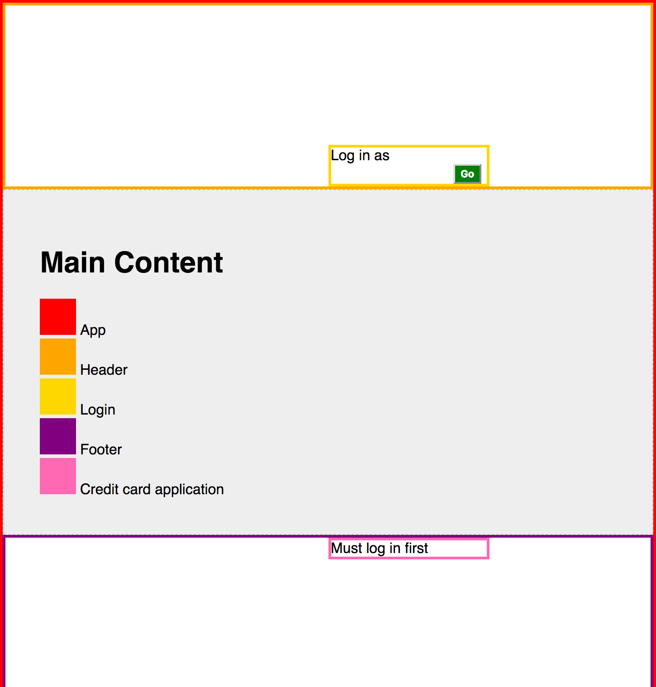
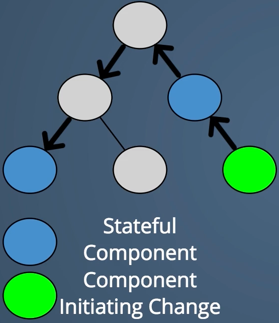

# Distant Components

The goals of this project are to show you sharing data among distant components (in the component tree) is a pain.

## Instructions

### Scenario

You have an ecommerce website. In the header, you allow users to login with a Login component.

In the footer, you allow users to start a credit card application with a CreditCardApplication component. Users may only apply for a credit card if they are logged in, because we want to provide a personal message for the process: "Hey [name], apply now!"

Therefore, the Login and CreditCardApplication components must communicate or share data. Your task is to pass the data from App.js to the components using built-in React functionality, meaning as props. The challenge is that the components are "distant". The Login component, for example, is in Header, which is in App. So you'll need to pass props, and the update methods to update the state in App.js, to Header, and then in turn pass from Header to Login. When you're done, the app should work.

Here's a visual:

Here's a more conceptual visual (note that it's taken from a separate video, so doesn't match our scenario exactly):

There is a solution in the `solution` branch.

## Next

Imagine what would happen if there were more components involved, such that the components that need to share data are even more distant. Ew. There more components there are, the greater this pain. Pain here doesn't just mean an annoyance/inconvenience for developers, it also means likelihood for mistakes over time as more values need to be shared.

## Solution

There are many solutions here. You could use React's context. But more common is to use a global store solution such as Redux or Mobx.

There is a solution with redux in the `with-redux` branch.